# 4.2.3 SYSTEM DIAGRAMS
## NSS Volunteer Management System - Design Diagrams

---

## Project Making Reference (Simple)

**How This Project Was Made:**

- **Design Tool Used:** Mermaid.js - An open-source diagramming and charting tool for creating diagrams from markdown-like syntax
- **Documentation Format:** Markdown (.md) - Easy to read, version control friendly
- **Diagram Types Created:** 
  - Flowcharts (Logic/Process flows)
  - Activity diagrams (Workflow visualization)
  - Use case diagrams (Actor interactions)
  - Sequence diagrams (Component interactions)
  - State machine diagrams (Entity state transitions)
  - Component diagrams (System architecture)

**Project Methodology:**
- Started with system requirements analysis
- Created logical process flows for each major feature
- Defined actors and their interactions
- Mapped component relationships
- Documented state transitions for key entities
- Used iterative design approach

**Key Resources Used in Making:**
- Mermaid.js syntax for diagram creation
- UML standards for use cases and sequences
- SDLC (Software Development Life Cycle) principles
- System Design best practices

**Version History:**
- Document Version: 1.0
- Date Created: February 22, 2026
- Status: FINAL
- Last Updated: March 5, 2026

---

## Overview
This section presents the system design through four complementary diagram types that illustrate the system's structure, processes, actors, and interactions.

---

## 1. LOGIC DIAGRAM (Process Flow)

The logic diagram illustrates the main processes and decision flows within the NSS Volunteer Management System.

### 1.1 Volunteer Registration & Authentication Flow

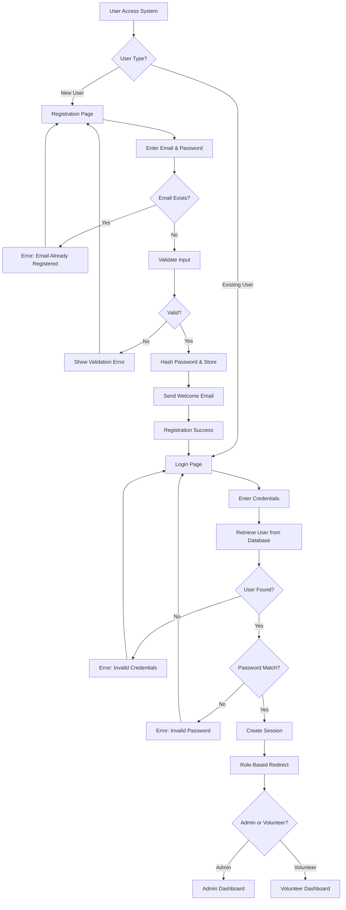
```mermaid
flowchart TD
    A[User Access System] --> B{User Type?}
    B -->|New User| C[Registration Page]
    B -->|Existing User| D[Login Page]
    
    C --> E[Enter Email & Password]
    E --> F{Email Exists?}
    F -->|Yes| G[Error: Email Already Registered]
    G --> C
    F -->|No| H[Validate Input]
    H --> I{Valid?}
    I -->|No| J[Show Validation Error]
    J --> C
    I -->|Yes| K[Hash Password & Store]
    K --> L[Send Welcome Email]
    L --> M[Registration Success]
    M --> D
    
    D --> N[Enter Credentials]
    N --> O[Retrieve User from Database]
    O --> P{User Found?}
    P -->|No| Q[Error: Invalid Credentials]
    Q --> D
    P -->|Yes| R{Password Match?}
    R -->|No| S[Error: Invalid Password]
    S --> D
    R -->|Yes| T[Create Session]
    T --> U[Role-Based Redirect]
    U --> V{Admin or Volunteer?}
    V -->|Admin| W[Admin Dashboard]
    V -->|Volunteer| X[Volunteer Dashboard]
```

### 1.2 Event Registration & Attendance Flow

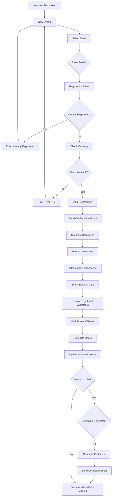
```mermaid
flowchart TD
    A[Volunteer Dashboard] --> B[View Events]
    B --> C[Select Event]
    C --> D{Event Details}
    D --> E[Register for Event]
    E --> F{Already Registered?}
    F -->|Yes| G[Error: Already Registered]
    G --> B
    F -->|No| H[Check Capacity]
    H --> I{Seats Available?}
    I -->|No| J[Error: Event Full]
    J --> B
    I -->|Yes| K[Add Registration]
    K --> L[Send Confirmation Email]
    L --> M[Success: Registered]
    M --> N[Event Date Arrives]
    
    N --> O[Admin Marks Attendance]
    O --> P[Select Event & Date]
    P --> Q[Display Registered Volunteers]
    Q --> R[Mark Present/Absent]
    R --> S[Calculate Hours]
    S --> T[Update Volunteer Hours]
    T --> U{Hours >= 120?}
    U -->|Yes| V{Certificate Generated?}
    V -->|No| W[Generate Certificate]
    W --> X[Send Certificate Email]
    X --> Y[Success: Attendance Marked]
    U -->|No| Y
```

### 1.3 Certificate Generation Flow

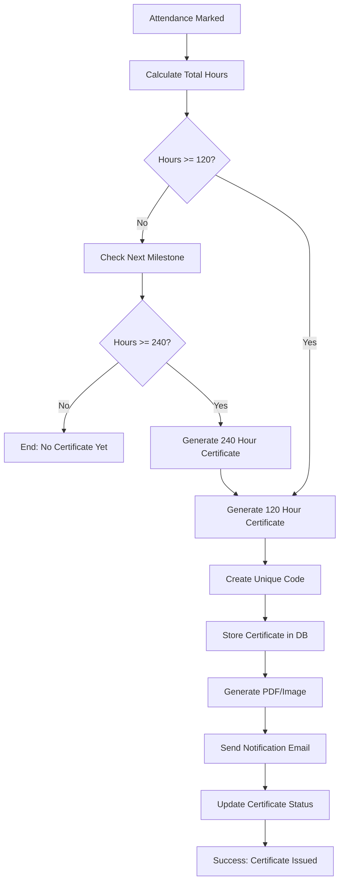
```mermaid
flowchart TD
    A[Attendance Marked] --> B[Calculate Total Hours]
    B --> C{Hours >= 120?}
    C -->|No| D[Check Next Milestone]
    D --> E{Hours >= 240?}
    E -->|No| F[End: No Certificate Yet]
    E -->|Yes| G[Generate 240 Hour Certificate]
    G --> H
    
    C -->|Yes| H[Generate 120 Hour Certificate]
    H --> I[Create Unique Code]
    I --> J[Store Certificate in DB]
    J --> K[Generate PDF/Image]
    K --> L[Send Notification Email]
    L --> M[Update Certificate Status]
    M --> N[Success: Certificate Issued]
```

### 1.4 Gallery & Photo Management Flow

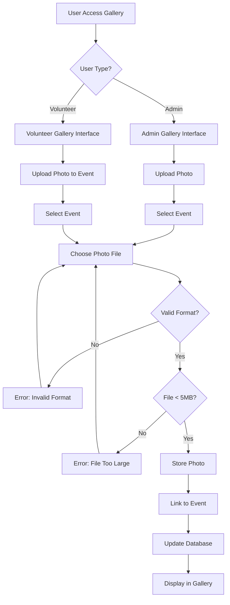
```mermaid
flowchart TD
    A[User Access Gallery] --> B{User Type?}
    B -->|Admin| C[Admin Gallery Interface]
    B -->|Volunteer| D[Volunteer Gallery Interface]
    
    C --> E[Upload Photo]
    E --> F[Select Event]
    F --> G[Choose Photo File]
    G --> H{Valid Format?}
    H -->|No| I[Error: Invalid Format]
    I --> G
    H -->|Yes| J{File < 5MB?}
    J -->|No| K[Error: File Too Large]
    K --> G
    J -->|Yes| L[Store Photo]
    L --> M[Link to Event]
    M --> N[Update Database]
    N --> O[Display in Gallery]
    
    D --> P[Upload Photo to Event]
    P --> Q[Select Event]
    Q --> G
```

### 1.5 Notification & Email Flow

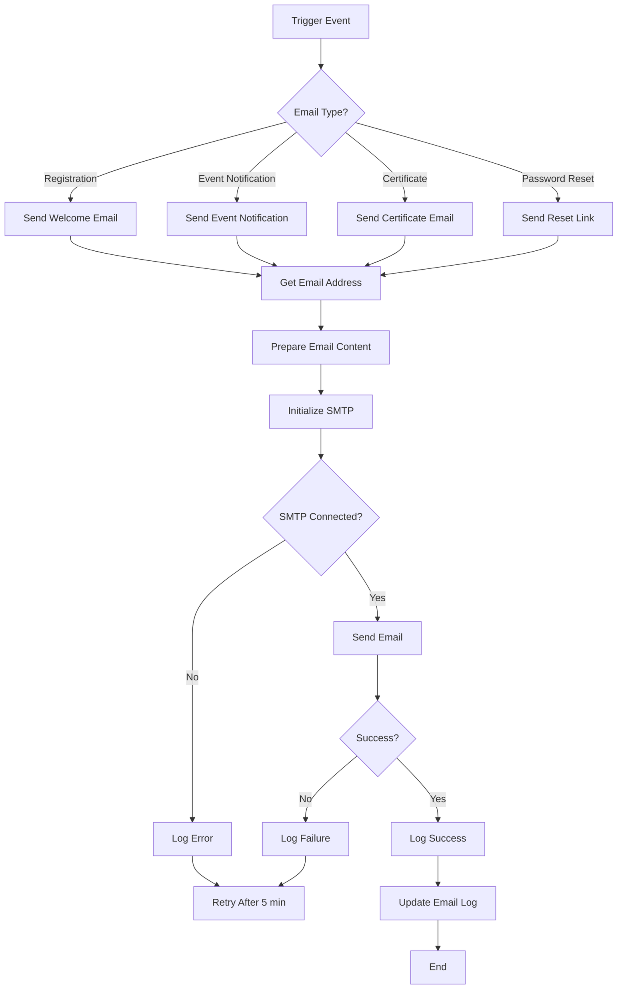
```mermaid
flowchart TD
    A[Trigger Event] --> B{Email Type?}
    B -->|Registration| C[Send Welcome Email]
    B -->|Event Notification| D[Send Event Notification]
    B -->|Certificate| E[Send Certificate Email]
    B -->|Password Reset| F[Send Reset Link]
    
    C --> G[Get Email Address]
    G --> H[Prepare Email Content]
    H --> I[Initialize SMTP]
    I --> J{SMTP Connected?}
    J -->|No| K[Log Error]
    K --> L[Retry After 5 min]
    J -->|Yes| M[Send Email]
    M --> N{Success?}
    N -->|No| O[Log Failure]
    O --> L
    N -->|Yes| P[Log Success]
    P --> Q[Update Email Log]
    Q --> R[End]
    
    D --> G
    E --> G
    F --> G
```

---

## 2. ACTIVITY DIAGRAM

Activity diagrams show the workflow and activities in the system with parallel processes where applicable.

### 2.1 Complete Volunteer Journey Activity Diagram

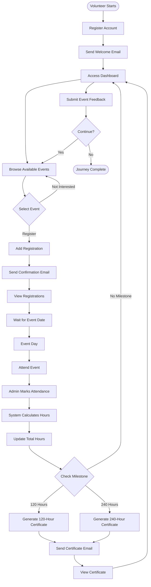
```mermaid
flowchart TD
    Start([Volunteer Starts]) --> Register[Register Account]
    Register --> SendWelcome[Send Welcome Email]
    SendWelcome --> Dashboard[Access Dashboard]
    
    Dashboard --> BrowseEvents[Browse Available Events]
    BrowseEvents --> SelectEvent{Select Event}
    
    SelectEvent -->|Not Interested| BrowseEvents
    SelectEvent -->|Register| AddReg[Add Registration]
    AddReg --> ConfEmail[Send Confirmation Email]
    ConfEmail --> ViewReg[View Registrations]
    
    ViewReg --> WaitEvent[Wait for Event Date]
    WaitEvent --> EventDay[Event Day]
    
    EventDay --> Attend[Attend Event]
    Attend --> AdminMark[Admin Marks Attendance]
    AdminMark --> CalcHours[System Calculates Hours]
    CalcHours --> UpdateDB[Update Total Hours]
    
    UpdateDB --> CheckMilestone{Check Milestone}
    CheckMilestone -->|120 Hours| Gen120[Generate 120-Hour Certificate]
    CheckMilestone -->|240 Hours| Gen240[Generate 240-Hour Certificate]
    CheckMilestone -->|No Milestone| Dashboard
    
    Gen120 --> SendCert[Send Certificate Email]
    Gen240 --> SendCert
    SendCert --> ViewCert[View Certificate]
    ViewCert --> Dashboard
    
    Dashboard --> Feedback[Submit Event Feedback]
    Feedback --> Continue{Continue?}
    Continue -->|Yes| BrowseEvents
    Continue -->|No| End([Journey Complete])
```

### 2.2 Admin Event Management Activity Diagram

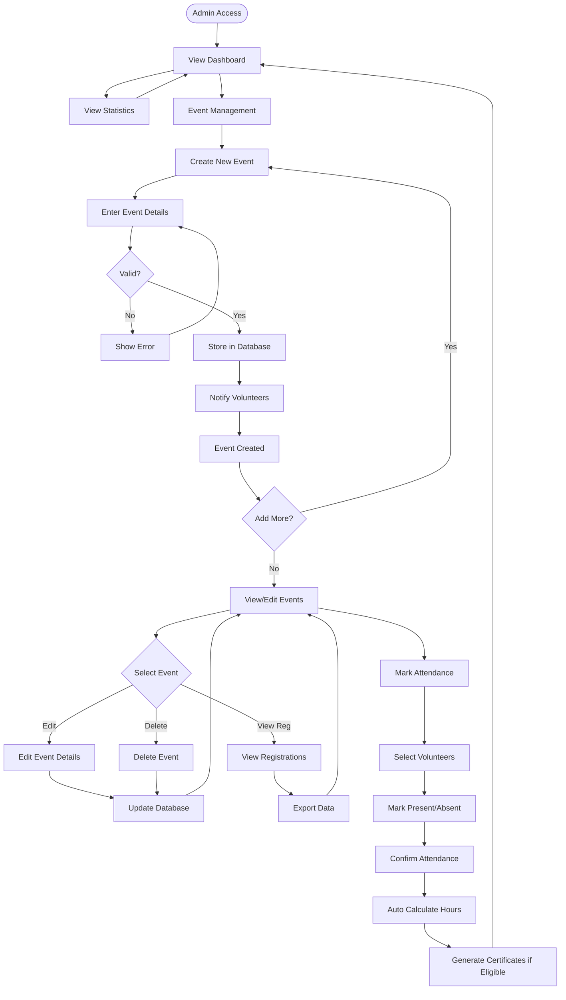
```mermaid
flowchart TD
    Start([Admin Access]) --> Dashboard[View Dashboard]
    Dashboard --> ViewStats[View Statistics]
    ViewStats --> Dashboard
    
    Dashboard --> EventMgmt[Event Management]
    EventMgmt --> CreateEvent[Create New Event]
    
    CreateEvent --> EnterDetails[Enter Event Details]
    EnterDetails --> Validate{Valid?}
    Validate -->|No| ErrorMsg[Show Error]
    ErrorMsg --> EnterDetails
    Validate -->|Yes| StoreEvent[Store in Database]
    StoreEvent --> NotifyVol[Notify Volunteers]
    NotifyVol --> EventList[Event Created]
    
    EventList --> MoreEvents{Add More?}
    MoreEvents -->|Yes| CreateEvent
    MoreEvents -->|No| Management[View/Edit Events]
    
    Management --> SelectEvent{Select Event}
    SelectEvent -->|Edit| EditEvent[Edit Event Details]
    EditEvent --> UpdateDB[Update Database]
    UpdateDB --> Management
    SelectEvent -->|Delete| DeleteEvent[Delete Event]
    DeleteEvent --> UpdateDB
    SelectEvent -->|View Reg| ViewReg[View Registrations]
    ViewReg --> ExportData[Export Data]
    ExportData --> Management
    
    Management --> MarkAttend[Mark Attendance]
    MarkAttend --> SelectVolun[Select Volunteers]
    SelectVolun --> MarkStatus[Mark Present/Absent]
    MarkStatus --> ConfirmAttend[Confirm Attendance]
    ConfirmAttend --> CalcHours[Auto Calculate Hours]
    CalcHours --> GenCerts[Generate Certificates if Eligible]
    GenCerts --> Dashboard
```

### 2.3 Certificate Generation Activity Diagram

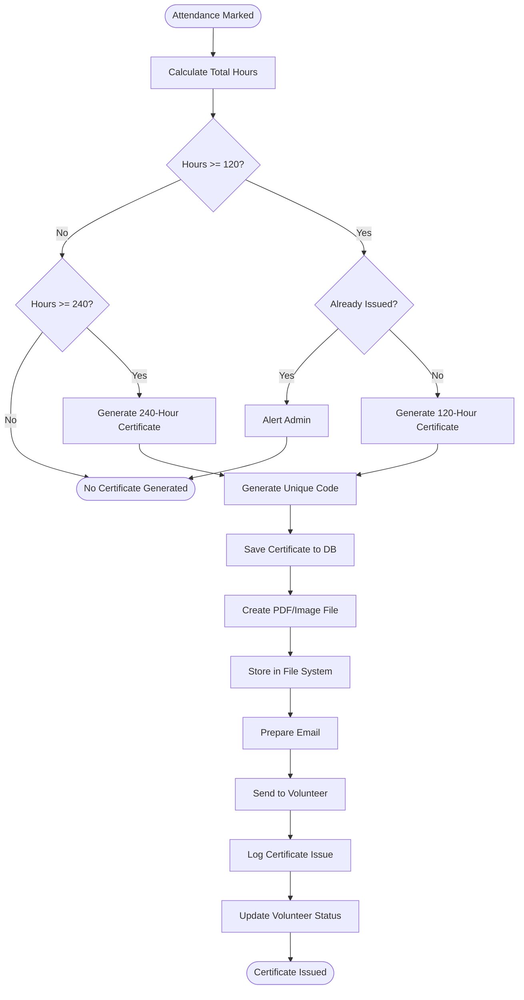
```mermaid
flowchart TD
    Start([Attendance Marked]) --> CalcHours[Calculate Total Hours]
    CalcHours --> Check120{Hours >= 120?}
    
    Check120 -->|No| Check240{Hours >= 240?}
    Check240 -->|No| End1([No Certificate Generated])
    Check240 -->|Yes| Gen240[Generate 240-Hour Certificate]
    
    Check120 -->|Yes| Already{Already Issued?}
    Already -->|Yes| AlertAdmin[Alert Admin]
    AlertAdmin --> End1
    Already -->|No| Gen120[Generate 120-Hour Certificate]
    
    Gen120 --> GenCode[Generate Unique Code]
    GenCode --> SaveCert[Save Certificate to DB]
    SaveCert --> CreateFile[Create PDF/Image File]
    CreateFile --> StoreFile[Store in File System]
    StoreFile --> PrepEmail[Prepare Email]
    PrepEmail --> SendEmail[Send to Volunteer]
    SendEmail --> LogEvent[Log Certificate Issue]
    LogEvent --> UpdateStatus[Update Volunteer Status]
    UpdateStatus --> End2([Certificate Issued])
    
    Gen240 --> GenCode
```

### 2.4 Admin Notification Activity Diagram

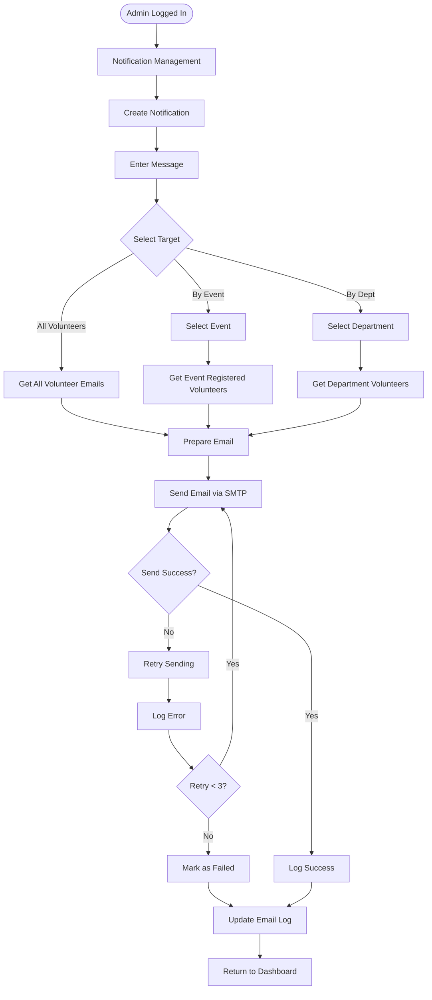
```mermaid
flowchart TD
    Start([Admin Logged In]) --> NotifMgmt[Notification Management]
    NotifMgmt --> CreateNotif[Create Notification]
    CreateNotif --> EnterMsg[Enter Message]
    EnterMsg --> SelectTarget{Select Target}
    
    SelectTarget -->|All Volunteers| GetAllVol[Get All Volunteer Emails]
    SelectTarget -->|By Event| SelectEvent[Select Event]
    SelectEvent --> GetEventVol[Get Event Registered Volunteers]
    SelectTarget -->|By Dept| SelectDept[Select Department]
    SelectDept --> GetDeptVol[Get Department Volunteers]
    
    GetAllVol --> PrepEmail[Prepare Email]
    GetEventVol --> PrepEmail
    GetDeptVol --> PrepEmail
    
    PrepEmail --> SendEmail[Send Email via SMTP]
    SendEmail --> LogEmail{Send Success?}
    LogEmail -->|No| Retry[Retry Sending]
    Retry --> LogError[Log Error]
    LogError --> CheckRetry{Retry < 3?}
    CheckRetry -->|Yes| SendEmail
    CheckRetry -->|No| FailEmail[Mark as Failed]
    
    LogEmail -->|Yes| LogSuccess[Log Success]
    FailEmail --> EmailLog[Update Email Log]
    LogSuccess --> EmailLog
    EmailLog --> Dashboard[Return to Dashboard]
```

---

## 3. USE CASE DIAGRAM

Use case diagrams show the actors (users) and their interactions with the system.

### 3.1 System Actors and Use Cases

```mermaid
graph TB
    subgraph Users
        Admin[Admin/NSS Coordinator]
        Volunteer[Volunteer]
        Guest[Guest User]
    end
    
    subgraph SystemBoundary ["NSS Volunteer Management System"]
        UC1["🔑 Register Account"]
        UC2["🔐 Login/Logout"]
        UC3["📝 Manage Profile"]
        UC4["📋 View Events"]
        UC5["✅ Register for Event"]
        UC6["👁️ View Registration"]
        UC7["🎯 Mark Attendance"]
        UC8["⏰ View Hours"]
        UC9["🏆 View Certificates"]
        UC10["📸 Manage Gallery"]
        UC11["📊 View Dashboard"]
        UC12["📧 Receive Notifications"]
        UC13["📝 Submit Feedback"]
        UC14["🎨 Create Event"]
        UC15["✏️ Edit Event"]
        UC16["🗑️ Delete Event"]
        UC17["👥 View Volunteers"]
        UC18["📄 Issue Certificate"]
        UC19["📨 Send Notification"]
        UC20["📉 Generate Reports"]
        UC21["🔧 System Admin"]
    end
    
    Guest -->UC1
    Guest -->UC4
    Guest -->UC2
    
    Volunteer -->UC2
    Volunteer -->UC3
    Volunteer -->UC4
    Volunteer -->UC5
    Volunteer -->UC6
    Volunteer -->UC8
    Volunteer -->UC9
    Volunteer -->UC10
    Volunteer -->UC11
    Volunteer -->UC12
    Volunteer -->UC13
    
    Admin -->UC2
    Admin -->UC11
    Admin -->UC14
    Admin -->UC15
    Admin -->UC16
    Admin -->UC7
    Admin -->UC17
    Admin -->UC18
    Admin -->UC19
    Admin -->UC20
    Admin -->UC21
```

### 3.2 Detailed Admin Use Cases

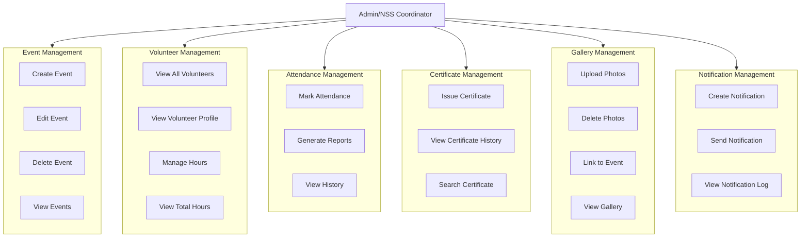
```mermaid
graph TB
    Admin["Admin/NSS Coordinator"]
    
    subgraph EventManagement ["Event Management"]
        CreateEvent["Create Event"]
        EditEvent["Edit Event"]
        DeleteEvent["Delete Event"]
        ViewEvents["View Events"]
    end
    
    subgraph VolunteerAdmin ["Volunteer Management"]
        ViewVols["View All Volunteers"]
        ViewProfile["View Volunteer Profile"]
        ManageHours["Manage Hours"]
        ViewHours["View Total Hours"]
    end
    
    subgraph AttendanceAdmin ["Attendance Management"]
        MarkAttend["Mark Attendance"]
        GenerateAttendReport["Generate Reports"]
        ViewAttendHistory["View History"]
    end
    
    subgraph CertAdmin ["Certificate Management"]
        IssueCert["Issue Certificate"]
        ViewCertHistory["View Certificate History"]
        SearchCert["Search Certificate"]
    end
    
    subgraph GalleryAdmin ["Gallery Management"]
        UploadPhoto["Upload Photos"]
        DeletePhoto["Delete Photos"]
        LinkPhoto["Link to Event"]
        ViewGallery["View Gallery"]
    end
    
    subgraph NotifAdmin ["Notification Management"]
        CreateNotif["Create Notification"]
        SendNotif["Send Notification"]
        ViewNotifLog["View Notification Log"]
    end
    
    Admin -->EventManagement
    Admin -->VolunteerAdmin
    Admin -->AttendanceAdmin
    Admin -->CertAdmin
    Admin -->GalleryAdmin
    Admin -->NotifAdmin
```

### 3.3 Detailed Volunteer Use Cases

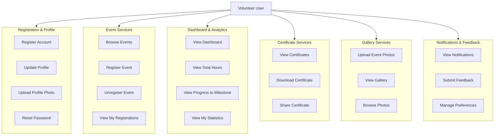
```mermaid
graph TB
    Volunteer["Volunteer User"]
    
    subgraph Registration ["Registration & Profile"]
        Register["Register Account"]
        UpdateProfile["Update Profile"]
        UploadPhoto["Upload Profile Photo"]
        ResetPassword["Reset Password"]
    end
    
    subgraph EventServices ["Event Services"]
        BrowseEvents["Browse Events"]
        RegisterEvent["Register Event"]
        UnregisterEvent["Unregister Event"]
        ViewRegistrations["View My Registrations"]
    end
    
    subgraph Dashboard ["Dashboard & Analytics"]
        ViewDashboard["View Dashboard"]
        ViewHours["View Total Hours"]
        ViewProgress["View Progress to Milestone"]
        ViewStats["View My Statistics"]
    end
    
    subgraph CertificateServices ["Certificate Services"]
        ViewCerts["View Certificates"]
        DownloadCert["Download Certificate"]
        ShareCert["Share Certificate"]
    end
    
    subgraph Gallery ["Gallery Services"]
        UploadPhoto2["Upload Event Photos"]
        ViewGallery2["View Gallery"]
        BrowsePhotos["Browse Photos"]
    end
    
    subgraph Notifications ["Notifications & Feedback"]
        ViewNotif["View Notifications"]
        SubmitFeedback["Submit Feedback"]
        ManagePrefs["Manage Preferences"]
    end
    
    Volunteer -->Registration
    Volunteer -->EventServices
    Volunteer -->Dashboard
    Volunteer -->CertificateServices
    Volunteer -->Gallery
    Volunteer -->Notifications
```

---

## 4. SEQUENCE DIAGRAM

Sequence diagrams show the interactions between components over time.

### 4.1 Volunteer Registration Sequence

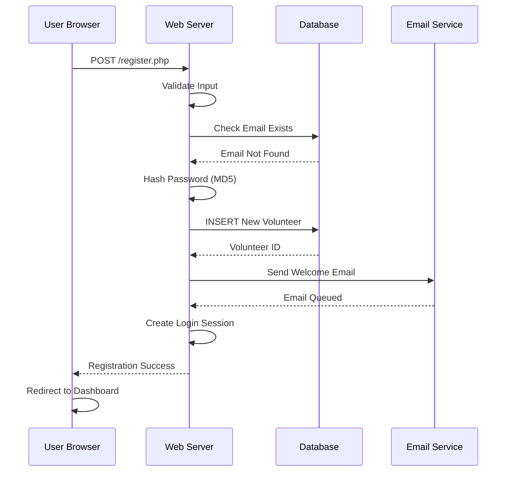
```mermaid
sequenceDiagram
    participant U as User Browser
    participant W as Web Server
    participant DB as Database
    participant EM as Email Service
    
    U->>W: POST /register.php
    W->>W: Validate Input
    W->>DB: Check Email Exists
    DB-->>W: Email Not Found
    W->>W: Hash Password (MD5)
    W->>DB: INSERT New Volunteer
    DB-->>W: Volunteer ID
    W->>EM: Send Welcome Email
    EM-->>W: Email Queued
    W->>W: Create Login Session
    W-->>U: Registration Success
    U->>U: Redirect to Dashboard
```

### 4.2 Event Registration & Attendance Sequence

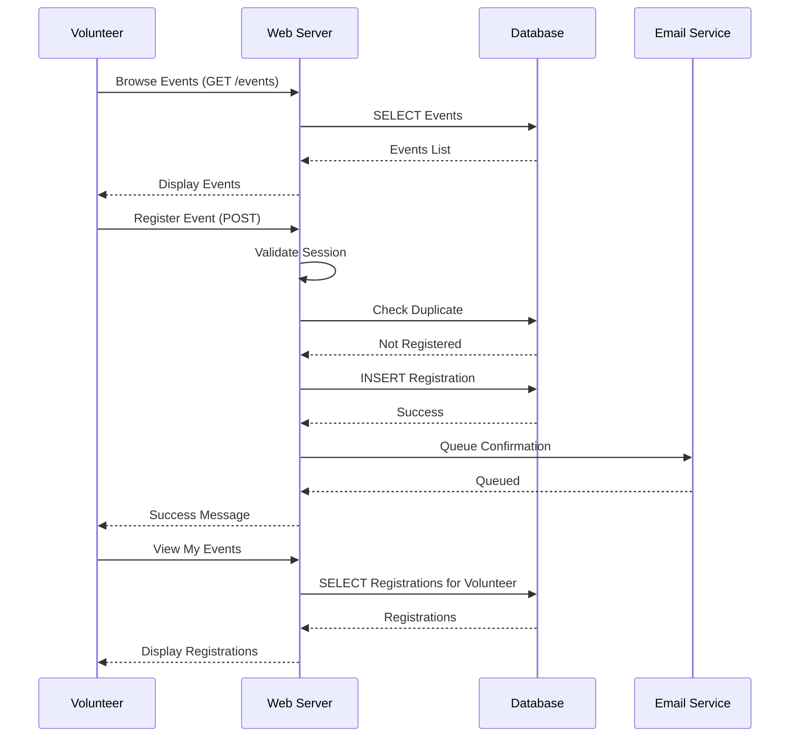
```mermaid
sequenceDiagram
    participant V as Volunteer
    participant WS as Web Server
    participant DB as Database
    participant ES as Email Service
    
    V->>WS: Browse Events (GET /events)
    WS->>DB: SELECT Events
    DB-->>WS: Events List
    WS-->>V: Display Events
    
    V->>WS: Register Event (POST)
    WS->>WS: Validate Session
    WS->>DB: Check Duplicate
    DB-->>WS: Not Registered
    WS->>DB: INSERT Registration
    DB-->>WS: Success
    WS->>ES: Queue Confirmation
    ES-->>WS: Queued
    WS-->>V: Success Message
    
    V->>WS: View My Events
    WS->>DB: SELECT Registrations for Volunteer
    DB-->>WS: Registrations
    WS-->>V: Display Registrations
```

### 4.3 Mark Attendance & Certificate Generation Sequence

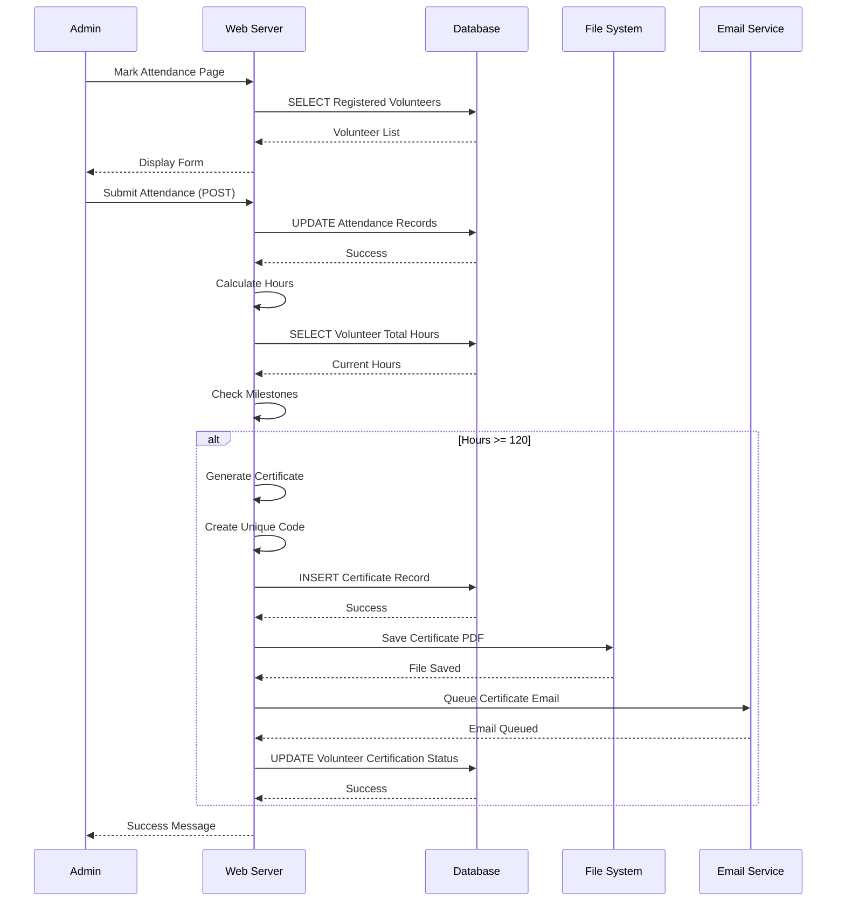
```mermaid
sequenceDiagram
    participant A as Admin
    participant WS as Web Server
    participant DB as Database
    participant FS as File System
    participant ES as Email Service
    
    A->>WS: Mark Attendance Page
    WS->>DB: SELECT Registered Volunteers
    DB-->>WS: Volunteer List
    WS-->>A: Display Form
    
    A->>WS: Submit Attendance (POST)
    WS->>DB: UPDATE Attendance Records
    DB-->>WS: Success
    WS->>WS: Calculate Hours
    WS->>DB: SELECT Volunteer Total Hours
    DB-->>WS: Current Hours
    WS->>WS: Check Milestones
    
    alt Hours >= 120
        WS->>WS: Generate Certificate
        WS->>WS: Create Unique Code
        WS->>DB: INSERT Certificate Record
        DB-->>WS: Success
        WS->>FS: Save Certificate PDF
        FS-->>WS: File Saved
        WS->>ES: Queue Certificate Email
        ES-->>WS: Email Queued
        WS->>DB: UPDATE Volunteer Certification Status
        DB-->>WS: Success
    end
    
    WS-->>A: Success Message
```

### 4.4 Admin Certificate Issuance Sequence

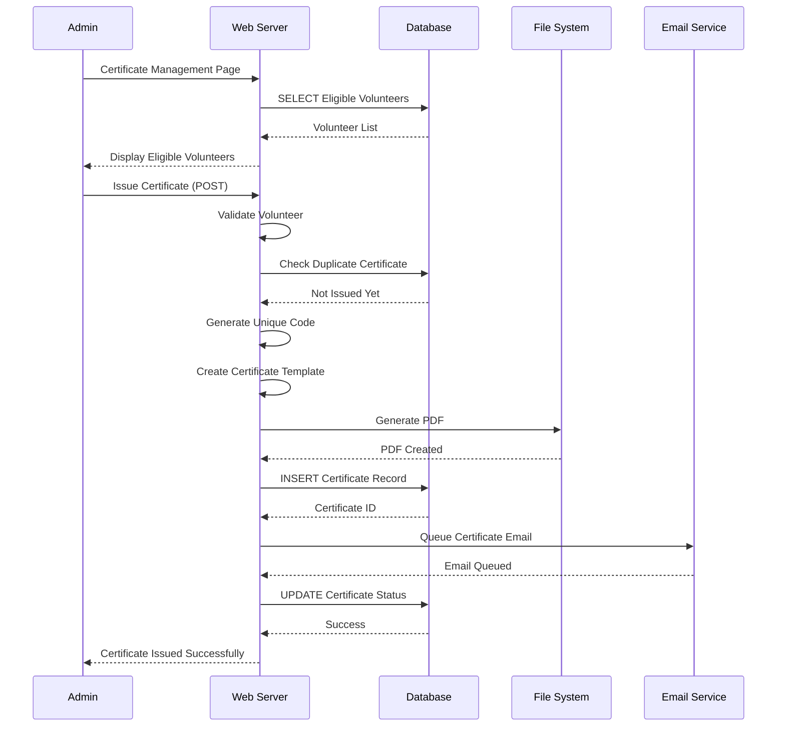
```mermaid
sequenceDiagram
    participant A as Admin
    participant WS as Web Server
    participant DB as Database
    participant FS as File System
    participant ES as Email Service
    
    A->>WS: Certificate Management Page
    WS->>DB: SELECT Eligible Volunteers
    DB-->>WS: Volunteer List
    WS-->>A: Display Eligible Volunteers
    
    A->>WS: Issue Certificate (POST)
    WS->>WS: Validate Volunteer
    WS->>DB: Check Duplicate Certificate
    DB-->>WS: Not Issued Yet
    WS->>WS: Generate Unique Code
    WS->>WS: Create Certificate Template
    WS->>FS: Generate PDF
    FS-->>WS: PDF Created
    WS->>DB: INSERT Certificate Record
    DB-->>WS: Certificate ID
    WS->>ES: Queue Certificate Email
    ES-->>WS: Email Queued
    WS->>DB: UPDATE Certificate Status
    DB-->>WS: Success
    WS-->>A: Certificate Issued Successfully
```

### 4.5 Notification System Sequence

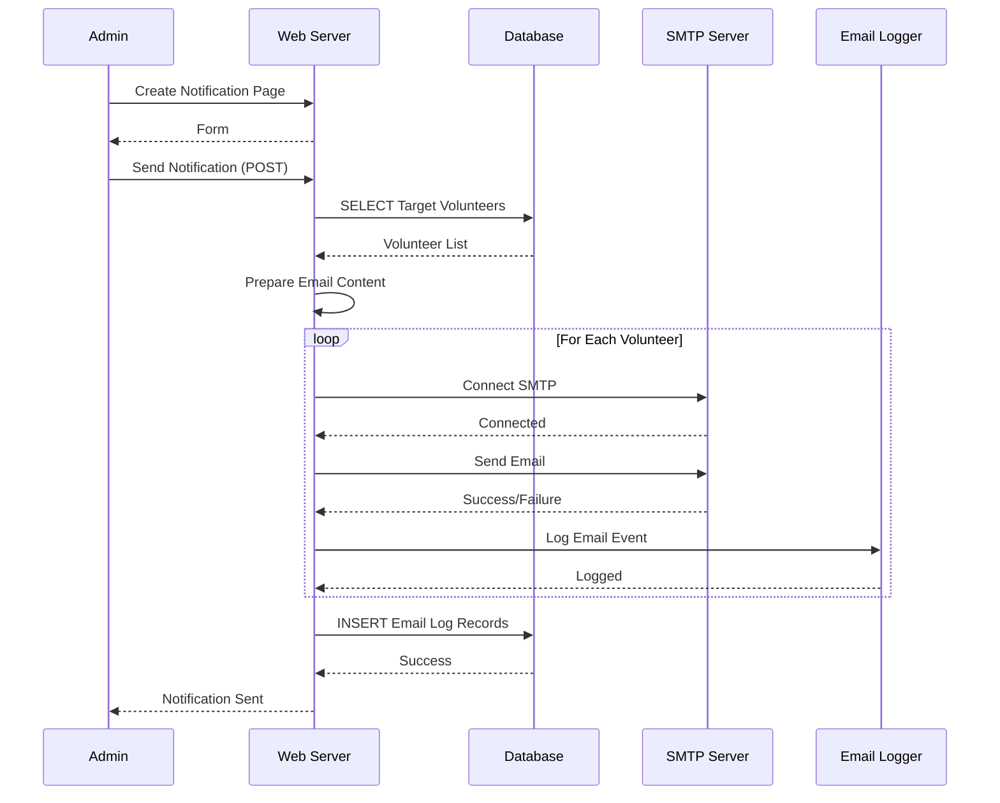
```mermaid
sequenceDiagram
    participant A as Admin
    participant WS as Web Server
    participant DB as Database
    participant SMTP as SMTP Server
    participant ES as Email Logger
    
    A->>WS: Create Notification Page
    WS-->>A: Form
    
    A->>WS: Send Notification (POST)
    WS->>DB: SELECT Target Volunteers
    DB-->>WS: Volunteer List
    WS->>WS: Prepare Email Content
    
    loop For Each Volunteer
        WS->>SMTP: Connect SMTP
        SMTP-->>WS: Connected
        WS->>SMTP: Send Email
        SMTP-->>WS: Success/Failure
        WS->>ES: Log Email Event
        ES-->>WS: Logged
    end
    
    WS->>DB: INSERT Email Log Records
    DB-->>WS: Success
    WS-->>A: Notification Sent
```

### 4.6 Dashboard Data Retrieval Sequence

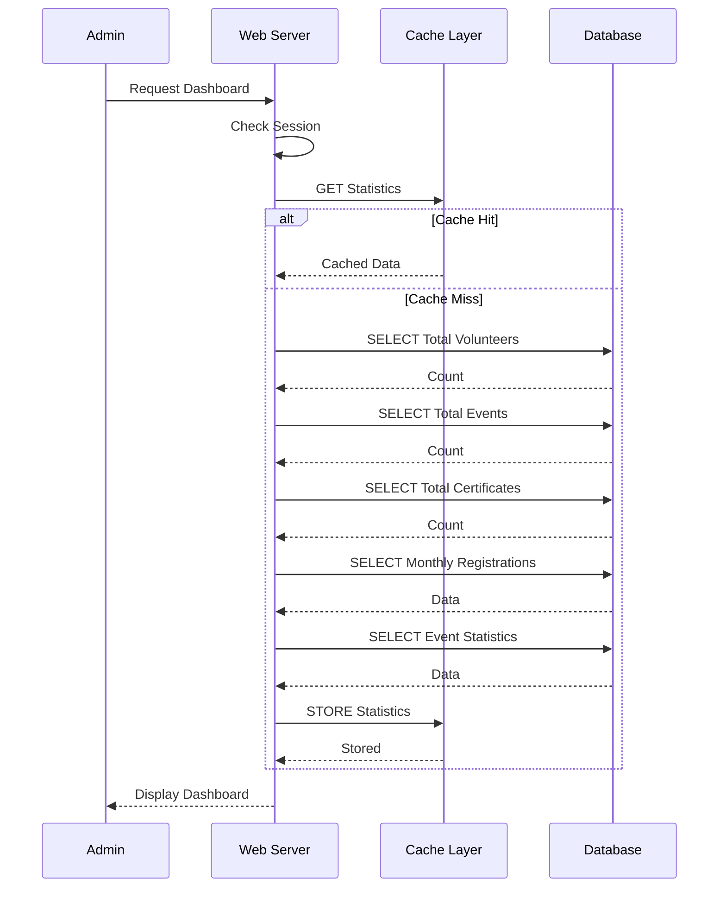
```mermaid
sequenceDiagram
    participant Admin as Admin
    participant WS as Web Server
    participant Cache as Cache Layer
    participant DB as Database
    
    Admin->>WS: Request Dashboard
    WS->>WS: Check Session
    
    WS->>Cache: GET Statistics
    alt Cache Hit
        Cache-->>WS: Cached Data
    else Cache Miss
        WS->>DB: SELECT Total Volunteers
        DB-->>WS: Count
        WS->>DB: SELECT Total Events
        DB-->>WS: Count
        WS->>DB: SELECT Total Certificates
        DB-->>WS: Count
        WS->>DB: SELECT Monthly Registrations
        DB-->>WS: Data
        WS->>DB: SELECT Event Statistics
        DB-->>WS: Data
        WS->>Cache: STORE Statistics
        Cache-->>WS: Stored
    end
    
    WS-->>Admin: Display Dashboard
```

### 4.7 Login & Session Management Sequence

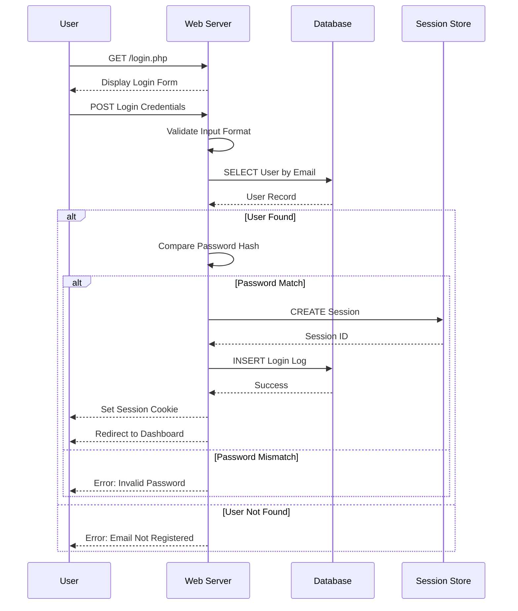
```mermaid
sequenceDiagram
    participant U as User
    participant WS as Web Server
    participant DB as Database
    participant SS as Session Store
    
    U->>WS: GET /login.php
    WS-->>U: Display Login Form
    
    U->>WS: POST Login Credentials
    WS->>WS: Validate Input Format
    WS->>DB: SELECT User by Email
    DB-->>WS: User Record
    
    alt User Found
        WS->>WS: Compare Password Hash
        alt Password Match
            WS->>SS: CREATE Session
            SS-->>WS: Session ID
            WS->>DB: INSERT Login Log
            DB-->>WS: Success
            WS-->>U: Set Session Cookie
            WS-->>U: Redirect to Dashboard
        else Password Mismatch
            WS-->>U: Error: Invalid Password
        end
    else User Not Found
        WS-->>U: Error: Email Not Registered
    end
```

### 4.8 Gallery Upload Sequence

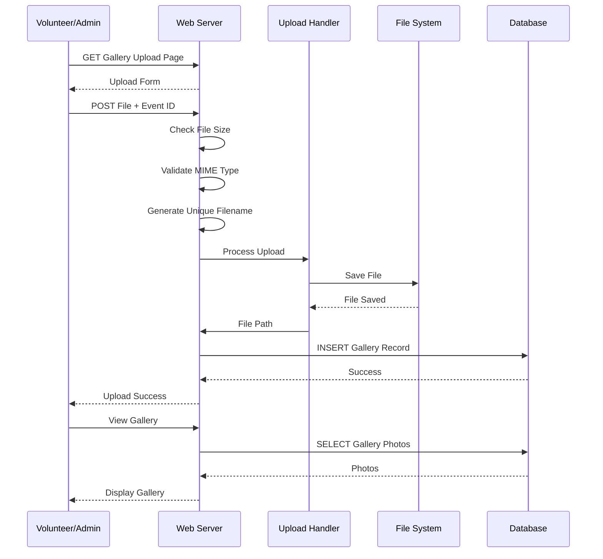
```mermaid
sequenceDiagram
    participant V as Volunteer/Admin
    participant WS as Web Server
    participant Upload as Upload Handler
    participant FS as File System
    participant DB as Database
    
    V->>WS: GET Gallery Upload Page
    WS-->>V: Upload Form
    
    V->>WS: POST File + Event ID
    WS->>WS: Check File Size
    WS->>WS: Validate MIME Type
    WS->>WS: Generate Unique Filename
    WS->>Upload: Process Upload
    Upload->>FS: Save File
    FS-->>Upload: File Saved
    Upload->>WS: File Path
    
    WS->>DB: INSERT Gallery Record
    DB-->>WS: Success
    
    WS-->>V: Upload Success
    V->>WS: View Gallery
    WS->>DB: SELECT Gallery Photos
    DB-->>WS: Photos
    WS-->>V: Display Gallery
```

---

## 5. COMPONENT INTERACTION DIAGRAM

```mermaid
graph TB
    subgraph Client["Client Layer"]
        Browser["Web Browser"]
        HTML["HTML/CSS/JS"]
        Bootstrap["Bootstrap 5.3"]
        Chart["Chart.js"]
    end
    
    subgraph Server["Server Layer (PHP)"]
        Router["Router/Controller"]
        Auth["Authentication Module"]
        EventMgr["Event Manager"]
        VolMgr["Volunteer Manager"]
        AttendMgr["Attendance Manager"]
        CertMgr["Certificate Manager"]
        GalleryMgr["Gallery Manager"]
        NotifMgr["Notification Manager"]
        ReportMgr["Report Manager"]
    end
    
    subgraph Services["External Services"]
        SMTP["SMTP Service"]
        FileSystem["File System"]
    end
    
    subgraph Database["Data Layer"]
        PDO["PDO Connection"]
        MySQL["MySQL Database"]
        Tables["Tables: Users, Events,<br/>Registrations, Attendance,<br/>Certificates, Gallery, Logs"]
    end
    
    Browser -->|HTTP/HTTPS| Router
    Router -->|Route| Auth
    Router -->|Route| EventMgr
    Router -->|Route| VolMgr
    Router -->|Route| AttendMgr
    Router -->|Route| CertMgr
    Router -->|Route| GalleryMgr
    Router -->|Route| NotifMgr
    Router -->|Route| ReportMgr
    
    Auth -->|Query/Update| PDO
    EventMgr -->|Query/Update| PDO
    VolMgr -->|Query/Update| PDO
    AttendMgr -->|Query/Update| PDO
    CertMgr -->|Query/Update| PDO
    GalleryMgr -->|Query/Update| PDO
    NotifMgr -->|Query/Update| PDO
    ReportMgr -->|Query| PDO
    
    PDO -->|SQL| MySQL
    MySQL -->|Result| PDO
    
    MySQL -->|Stores| Tables
    
    NotifMgr -->|Send Email| SMTP
    CertMgr -->|Save Files| FileSystem
    GalleryMgr -->|Save/Retrieve| FileSystem
    
    Router -->|Response HTML| Browser
    Chart -->|Visualize Data| Browser
    Bootstrap -->|Style| Browser
    HTML -->|Render| Browser
```

---

## 6. STATE MACHINE DIAGRAM

### 6.1 Volunteer State Machine

```mermaid
stateDiagram-v2
    [*] --> NotRegistered: User Visits Site
    
    NotRegistered --> Registered: Complete Registration
    Registered --> Active: Email Verified
    Active --> Inactive: No Activity 30 Days
    Inactive --> Active: Register for Event
    
    Active --> Certified_120: Reach 120 Hours
    Active --> Certified_240: Reach 240 Hours
    
    Certified_120 --> Certified_240: Complete 240 Hours
    Certified_240 --> CertificateEarned
    Certified_120 --> CertificateEarned
    
    Active --> Suspended: Admin Action
    Suspended --> Active: Admin Unsuspend
    
    Registered --> Deactivated: Request Deletion
    Active --> Deactivated: Request Deletion
    Deactivated --> [*]
```

### 6.2 Event State Machine

```mermaid
stateDiagram-v2
    [*] --> Planning: Admin Creates Event
    
    Planning --> Open: Event Approved
    Open --> InProgress: Event Date Arrives
    InProgress --> Completed: Event Ends
    Completed --> Archived: After 30 Days
    
    Planning --> Cancelled: Admin Cancels
    Open --> Cancelled: Admin Cancels
    
    Cancelled --> [*]
    Archived --> [*]
```

### 6.3 Certificate State Machine

```mermaid
stateDiagram-v2
    [*] --> NotEligible: Volunteer Registered
    
    NotEligible --> Eligible_120: 120 Hours Reached
    Eligible_120 --> Earned_120: Certificate Generated
    
    Earned_120 --> Eligible_240: 240 Hours Reached
    Eligible_240 --> Earned_240: Certificate Generated
    
    Earned_120 --> Issued: Admin Issues
    Earned_240 --> Issued: Admin Issues
    
    Issued --> Downloaded: Volunteer Downloads
    Downloaded --> [*]
```

---

## 7. DIAGRAM LEGEND & SYMBOLS

### 7.1 Process Flow Symbols
- **Start/End**: Rounded Rectangle (⭕)
- **Process**: Rectangle (▢)
- **Decision**: Diamond (◇)
- **Data/Database**: Cylinder (⚪)
- **Input/Output**: Parallelogram (▱)
- **Arrow**: Shows flow direction

### 7.2 Sequence Diagram Symbols
- **Actor**: Stick Figure (👤)
- **Object**: Rectangle
- **Message**: Arrow with label
- **Activation**: Vertical Line
- **Return**: Dashed Arrow
- **Loop/Alt**: Frame around interactions

### 7.3 Use Case Symbols
- **Actor**: Stick Figure
- **Use Case**: Oval
- **System Boundary**: Rectangle
- **Association**: Line
- **Include/Extend**: Dashed Arrow

---

## SUMMARY

| Diagram Type | Purpose | Key Information |
|---|---|---|
| **Logic Diagram** | Show process flow and decision points | Registration, Events, Certificates, Gallery |
| **Activity Diagram** | Show activities and data flow | Parallel activities, swimlanes, decisions |
| **Use Case Diagram** | Show actors and their interactions | Users, System boundary, Use cases |
| **Sequence Diagram** | Show component interactions over time | Message flow, Database calls, API calls |
| **State Machine** | Show entity states and transitions | State changes, Events triggering changes |
| **Component** | Show system architecture layers | Client, Server, Database, External Services |

---

**Document Version:** 1.0
**Date Created:** February 22, 2026
**Status:** FINAL
**Diagrams Created Using:** Mermaid.js
